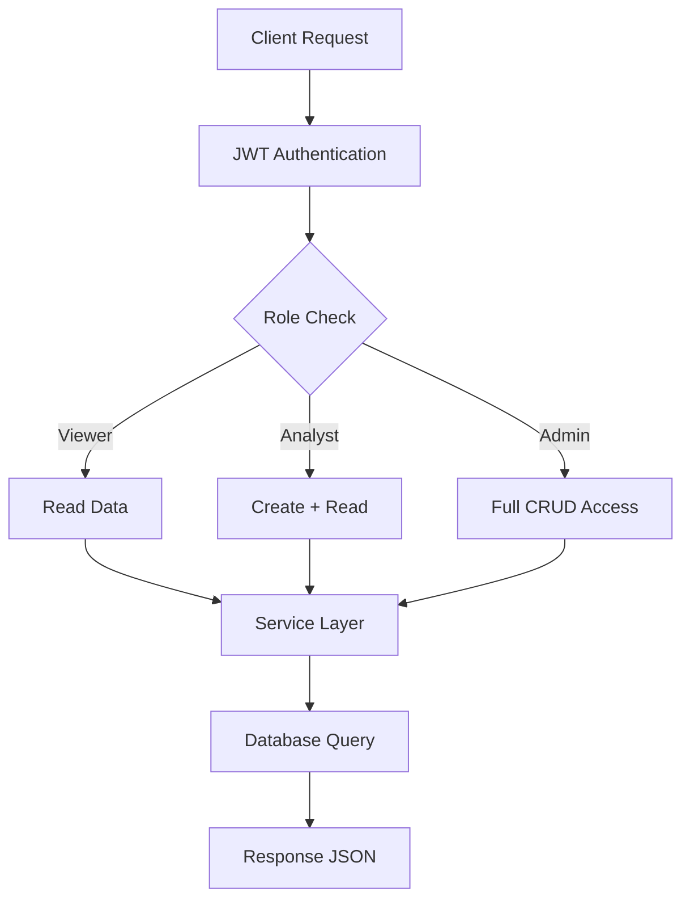

# 🚀 FinScope

### 💰 Production-Grade Finance Backend Built for Scalable Analytics Systems


🔗 **Live API:** https://finscope-r75y.onrender.com/  
📂 **Repository:** https://github.com/Harshavardhanjakku/FinScope  

---

# 📌 Problem Statement

Personal finance systems are often fragmented, insecure, and lack structured insights.  
Users need a backend system that can:

- Store financial data reliably  
- Provide meaningful analytics  
- Enforce secure role-based access  
- Scale for real-world usage  

---

# 💡 Solution Overview

**FinScope** is a robust backend system designed to:

- Manage financial transactions efficiently  
- Provide real-time analytics and insights  
- Secure APIs using JWT authentication  
- Enforce strict role-based access control  
- Serve as a scalable backend for finance applications  

---

# ⚙️ Tech Stack

### 🧠 Backend


### 🗄️ Database


### 🔐 Authentication


### ☁️ Deployment


---

# 🏗️ System Architecture

```mermaid
flowchart LR
A[Client] --> B[Flask API]
B --> C[Routes Layer]
C --> D[Service Layer]
D --> E[SQLAlchemy ORM]
E --> F[(PostgreSQL - Neon)]
````

---

# 🧠 Database Schema

```mermaid
erDiagram
    USERS {
        int id
        string email
        string password
        string role
    }

    TRANSACTIONS {
        int id
        int user_id
        float amount
        string type
        string category
        datetime date
        string notes
    }

    USERS ||--o{ TRANSACTIONS : owns
```

---

# 🔄 Workflow Diagram



---

# 📡 API Documentation

## 🔑 POST /register

**Description:** Register a new user

### Request

```json
{
  "email": "user@test.com",
  "password": "123456",
  "role": "admin"
}
```

### Response

```json
{
  "message": "User registered successfully"
}
```

### Status Codes

* 201 Created
* 400 Bad Request

---

## 🔑 POST /login

**Description:** Authenticate user and return JWT

### Request

```json
{
  "email": "user@test.com",
  "password": "123456"
}
```

### Response

```json
{
  "token": "jwt_token_here"
}
```

### Status Codes

* 200 OK
* 401 Unauthorized

---

## 💸 GET /transactions

**Description:** Fetch all transactions

### Query Params

* type (income / expense)
* category (string)

### Response

```json
[
  {
    "id": 1,
    "amount": 5000,
    "type": "income",
    "category": "salary",
    "date": "2026-04-01"
  }
]
```

---

## 💸 POST /transactions

**Description:** Create transaction

### Request

```json
{
  "amount": 1000,
  "type": "expense",
  "category": "food",
  "date": "2026-04-03",
  "notes": "Dinner"
}
```

### Response

```json
{
  "message": "Transaction created successfully"
}
```

### Status Codes

* 201 Created
* 400 Bad Request

---

## 💸 PUT /transactions/{id}

**Description:** Update transaction

---

## 💸 DELETE /transactions/{id}

**Description:** Delete transaction

---

## 📊 GET /analytics/summary

```json
{
  "total_income": 50000,
  "total_expense": 20000,
  "balance": 30000
}
```

---

## 📊 GET /analytics/category

```json
[
  {
    "category": "salary",
    "total": 5000
  }
]
```

---

## 📊 GET /analytics/monthly

```json
[
  {
    "month": "2026-04",
    "total": 5000
  }
]
```

---

# ⚠️ Error Handling

```json
{
  "error": "Invalid input",
  "message": "Amount must be positive",
  "status": 400
}
```

---

# 🔐 Authentication & Roles

| Role    | Access        |
| ------- | ------------- |
| Viewer  | Read-only     |
| Analyst | Read + Create |
| Admin   | Full CRUD     |

---

# 📊 Analytics Logic

* **Balance** = Total Income - Total Expense
* **Category Breakdown** = Sum grouped by category
* **Monthly Summary** = Aggregated by month

---

# ⚙️ Environment Variables

```env
DATABASE_URL=your_neon_db_url
JWT_SECRET_KEY=your_secret
SECRET_KEY=your_secret
```

---

# 🚀 Getting Started

```bash
git clone https://github.com/Harshavardhanjakku/FinScope.git
cd FinScope
pip install -r requirements.txt
flask run
```

---

# 🌍 Deployment

* Hosted on **Render**
* Database via **Neon PostgreSQL**
* Uses environment variables for configuration

---

# 📁 Project Structure

```
app/
 ├── routes/
 ├── models/
 ├── services/
 ├── schemas/
 ├── config/
 ├── utils/
 ├── extensions.py
 └── main.py
```

---

# ✨ Features

* 🔐 JWT Authentication with RBAC
* 💸 Full Transaction Management
* 📊 Real-time Financial Analytics
* ⚡ Clean Service-Layer Architecture
* ☁️ Cloud Deployment Ready
* 📡 RESTful API Design

---

# 🧠 Why This Project Stands Out

* Follows clean architecture principles
* Implements real-world RBAC system
* Production-ready deployment setup
* Designed for scalability and integration

---

# 🔮 Future Improvements

* Pagination & filtering
* Swagger API docs
* Unit testing
* CSV export
* Search functionality

---

# 🤝 Contribution

Contributions are welcome. Fork the repo and submit a PR.

---
 